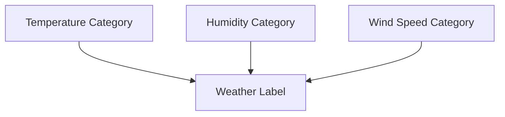

<div align="center">

# ☀️ AI Weather Predictor

### *Intelligent Weather Forecasting with Bayesian Networks & Markov Models*

[](https://www.python.org/downloads/)
[](LICENSE)
[](https://github.com/TomSchimansky/CustomTkinter)

[Features](#-features) • [Installation](#-installation) • [Usage](#-usage) • [How It Works](#-how-it-works) • [Documentation](#-documentation)


</div>

---

## 📋 Overview

A sophisticated weather prediction application that combines **Bayesian Networks** and **Markov Models** to forecast weather conditions up to 7 days in advance. Built with Python and CustomTkinter for an intuitive, modern user experience.

## ✨ Features

### 🤖 Hybrid AI Prediction System
- **Bayesian Network** for current weather classification
- **Markov Model** for multi-day forecasting
- **Maximum Likelihood Estimation** for model training

### 🎨 Interactive GUI
- 🌓 Dark/Light theme toggle
- ⚡ Real-time weather predictions
- 📅 7-day forecast display
- 🌡️ Temperature unit conversion (°C, °F, K)
- 📊 Transition probability visualization

### 📊 Data-Driven Insights
- 📈 Trained on historical weather data
- 🎯 Smart categorization of weather parameters
- 🔄 Probabilistic weather state transitions

## 🛠️ Tech Stack

<table>
<tr>
<td>

**Core**
- Python 3.7+
- CustomTkinter
- pgmpy

</td>
<td>

**Data & ML**
- pandas
- numpy
- scikit-learn

</td>
<td>

**Visualization**
- matplotlib
- networkx

</td>
</tr>
</table>

### Prerequisites

- Python 3.7 or higher
- pip package manager

### Quick Start

1️⃣ **Clone the repository**
```bash
git clone https://github.com/win-x-u-r/csai350-project.git
cd csai350-project
```

2️⃣ **Install dependencies**
```bash
pip install customtkinter pandas numpy matplotlib networkx pgmpy
```

3️⃣ **Run the application**
```bash
python weather_predictor_app.py
```

> **Note:** Ensure `cleaned_weather.csv` is in the project directory before running.

## 🚀 Usage

### 📝 Making Predictions

1. **Enter Weather Parameters:**
   - Temperature (°C)
   - Humidity (%)
   - Wind Speed (m/h)

2. **Select Forecast Duration:**
   - Use the slider to choose 1-7 days

3. **Click "Predict Weather":**
   - Current weather condition displayed with icon
   - Future forecasts shown in daily cards

4. **View Transition Graph:**
   - Click "Show Graph" to visualize weather transition probabilities

### 🔮 Bayesian Network

The application uses a **Discrete Bayesian Network** with the following structure:



- **Nodes:** Temperature, Humidity, Wind Speed Categories
- **Target:** Weather Label
- **Training:** Maximum Likelihood Estimation

#### 📊 Parameter Discretization

| Parameter | Low | Medium | High |
|-----------|-----|--------|------|
| 🌡️ **Temperature** | < 5°C | 5-20°C | > 20°C |
| 💧 **Humidity** | < 40% | 40-70% | > 70% |
| 💨 **Wind Speed** | ≤ 3 m/h | 3-7 m/h | > 7 m/h |

### 🔄 Markov Model

For multi-day forecasting:

```
Current State → Transition Matrix → Next State → Continuous Values
```

1. 📈 Builds transition probability matrix from historical sequences
2. 🎲 Predicts next day's weather based on current state
3. 🎯 Estimates continuous values for each predicted state

### 🎯 Continuous Value Estimation

Smart fallback strategy for accurate predictions:

```
1. ✅ Exact match (all categories + weather state)
2. 🎯 Partial matches (2/3 categories, weighted)
3. 📊 Single category matches (lower weight)
4. 🌤️ Weather state averages
5. 📈 Overall dataset averages
```

## 🌤️ Weather States

<div align="center">

| Icon | Weather | Icon | Weather |
|:----:|---------|:----:|---------|
| ☀️ | Sunny / Clear | 🌧️ | Rainy |
| ⚡ | Thunderstorm / Storm | ☁️ | Cloudy |
| ⛅ | Partly Cloudy | 🌫️ | Fog / Mist |
| ❄️ | Snow | 💨 | Strong Wind |

</div>

## 🎨 UI Features

<details open>
<summary><b>Interface Components</b></summary>

- 🏠 **Header:** Location display and theme toggle
- 🌡️ **Current Weather:** Large display with icon, temperature, humidity, and wind
- ✏️ **Input Section:** Easy-to-use entry fields and forecast duration slider
- 🎛️ **Button Controls:** Predict and graph visualization buttons
- 🔄 **Unit Selector:** Convert between Celsius, Fahrenheit, and Kelvin
- 📅 **Forecast Cards:** 7-day forecast with dates, icons, and detailed metrics

</details>

## 📊 Data Format

The application expects `cleaned_weather.csv` with the following schema:

| Column | Type | Description |
|--------|------|-------------|
| `temperature` | float | Temperature in Celsius |
| `humidity` | float | Humidity percentage (0-100) |
| `wind` | float | Wind speed in m/h |
| `weather_label` | string | Weather condition label |

## 📁 Project Structure

```
csai350-project/
│
├── 📄 weather_predictor_app.py    # Main application file
├── 📊 cleaned_weather.csv          # Training data
└── 📖 README.md                    # Project documentation
```

## 🔧 Technical Details

<div align="center">

| Component | Technology |
|-----------|-----------|
| **Framework** | CustomTkinter (modern tkinter-based UI) |
| **Machine Learning** | pgmpy for Bayesian Network inference |
| **Data Processing** | pandas, numpy |
| **Visualization** | matplotlib, networkx |
| **Python Version** | 3.7+ |

</div>

## ✅ Input Validation

The application includes robust error handling:

- ✓ Humidity must be between 0-100%
- ✓ Wind speed cannot be negative
- ✓ All inputs must be valid numbers
- ✓ Graceful error messages for invalid inputs

## 🚧 Future Enhancements

- [ ] Real-time weather data integration via API
- [ ] Location-based predictions with GPS
- [ ] Historical weather comparison charts
- [ ] Export forecast data to CSV/JSON
- [ ] Advanced visualization options
- [ ] Mobile app version
- [ ] Multi-language support

## 📄 License

This project is part of the **CSAI 350** coursework.

## 👨‍💻 Author

**Created for CSAI 350 - Introduction to Artificial Intelligence**

<div align="center">

---

### 🙏 Acknowledgments

Special thanks to:
- [pgmpy](https://github.com/pgmpy/pgmpy) library for Bayesian Network implementation
- [CustomTkinter](https://github.com/TomSchimansky/CustomTkinter) for modern UI components
- Weather data contributors

---

<p>If you found this project helpful, please consider giving it a ⭐!</p>

**[⬆ Back to Top](#-ai-weather-predictor)**

</div>
